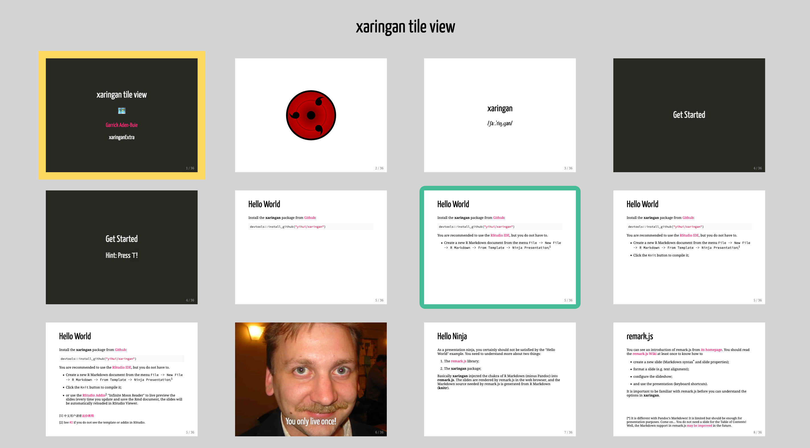
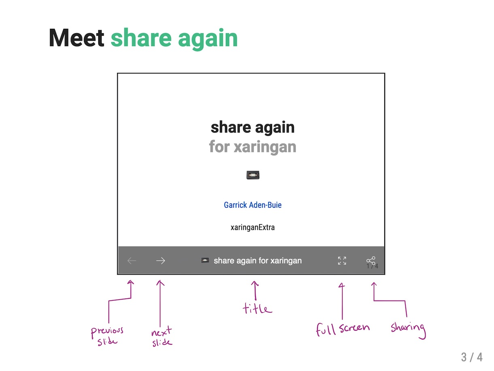
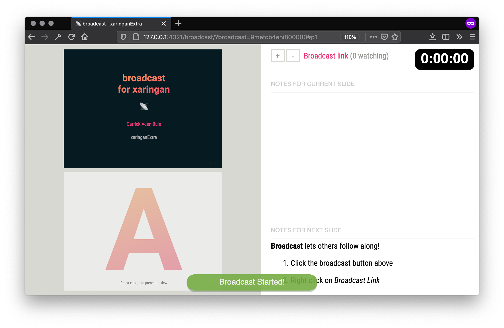
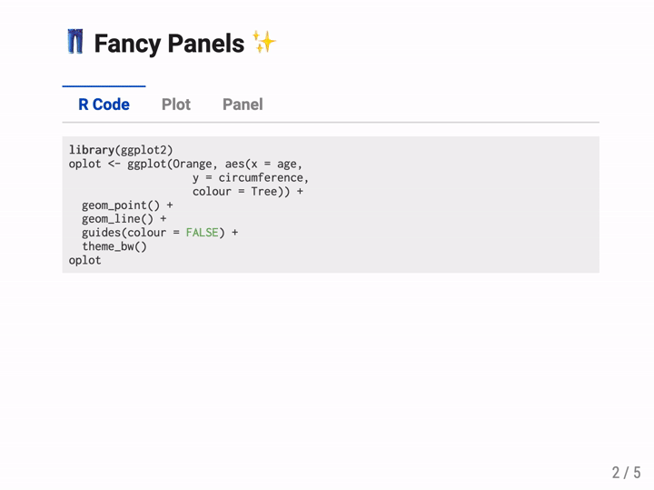
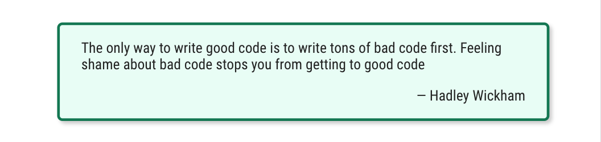

xaringanExtra
================

<!-- badges: start -->

[](https://CRAN.R-project.org/package=xaringanExtra)
[](https://gadenbuie.r-universe.dev)
[](https://github.com/gadenbuie/xaringanExtra/actions/workflows/tic.yml)
<!-- badges: end -->

<!-- Links -->

`xaringanExtra` is a playground of enhancements and extensions for
[xaringan](https://slides.yihui.org/xaringan) slides.

-   Add an overview of your presentation with [tile view](#-tile-view)
-   Make your slides [editable](#-editable)
-   Share your slides in style with [share again](#-share-again)
-   Broadcast your slides in real time to viewers with
    [broadcast](#-broadcast)
-   Scribble on your slides during your presentation with
    [scribble](#-scribble)
-   Announce slide changes with a [subtle tone](#-slide-tone)
-   Animate slide transitions with [animate.css](#-animatecss)
-   Add tabbed panels to slides with [panelset](#-panelset)
-   Add a logo to all of your slides with [logo](#-logo)
-   Add a top or bottom banner to all of your slides with
    [banner](#-banner)
-   Add a search box to search through your slides with
    [search](#-search)
-   Use the [Tachyons CSS utility toolkit](#-tachyons)
-   Add a live video feed of your [webcam](#-webcam)
-   Add one-click code copying with [clipboard](#-clipboard)
-   Always play gifs from the start with [freezeframe](#-freezeframe)
-   Fit your slides to [fill the browser window](#-fit-to-screen)
-   Add [extra CSS styles](#-extra-styles)

Each item can be enabled separately, or load everything at once with a
single call.

```` markdown
```{r xaringanExtra, echo=FALSE}
xaringanExtra::use_xaringan_extra(c("tile_view", "animate_css", "tachyons"))
```
````

## Installation

You can install the released version of xaringanExtra from CRAN:

``` r
install.packages("xaringanExtra")
```

You can install the latest development version from
[GitHub](https://github.com/gadenbuie/xaringanExtra/):

``` r
# install.packages("remotes")
remotes::install_github("gadenbuie/xaringanExtra")
```

or from [gadenbuie.r-universe.dev](https://gadenbuie.r-universe.dev/):

``` r
options(repos = c(
  gadenbuie = 'https://gadenbuie.r-universe.dev',
  CRAN = 'https://cloud.r-project.org'
))

install.packages('xaringanExtra')
```

## 🗺 Tile View

#### 📺 [Tile View Demo](https://pkg.garrickadenbuie.com/xaringanExtra/tile-view/)

Tile view gives you a way to quickly jump between slides. Just press
<kbd>O</kbd> (the letter **O** for **O**verview) at any point in your
slideshow and the tile view appears. Click on a slide to jump to the
slide, or press <kbd>O</kbd> to exit tile view.



To add tile view to your xaringan presentation, add the following code
chunk to your slides’ R Markdown file.

```` markdown
```{r xaringan-tile-view, echo=FALSE}
xaringanExtra::use_tile_view()
```
````

Tile view is heavily inspired by (and is essentially a port to Vanilla
JavaScript of) [a jQuery remarkjs
hook](https://github.com/StephenHesperus/remark-hook/) by the same name
by [Stephen Hesperus](https://github.com/StephenHesperus).

## 📝 Editable

#### 📺 [Editable Demo](https://pkg.garrickadenbuie.com/xaringanExtra/editable/)

Editable gives you a way to write directly inside your slides, updating
your content live. Make any element of your slides editable by using the
`.can-edit[...]` class.


Make your slides editable with the following code chunk.

```` markdown
```{r xaringan-editable, echo=FALSE}
xaringanExtra::use_editable(expires = 1)
```
````

Then, to make a component of your slides editable, use the `.can-edit[]`
class.

``` markdown
## .can-edit[You can edit this slide title]
```

Editable fields that only have the `.can-edit` class are reset whenever
the slides are re-loaded in your browser. If you want to store the
edited values and have them persist across browser sessions, give each
editable field a `.key-<NAME>` class. Be sure to make each key unique
and note that the key name must be a valid CSS class, i.e. it cannot
contain spaces.

``` markdown
## .can-edit.key-firstSlideTitle[Change this title and then reload the page]
```

For more complicated HTML elements, it’s best to make only spans of text
editable, such as

    Hello, .can-edit[world], and welcome to my talk!

or to use placeholder text.

``` markdown
## A few of my favorite things

.can-edit.key-likes[
- thing one
- thing two
]
```

## 📼 Share Again

#### 📺 [Share Again](https://pkg.garrickadenbuie.com/xaringanExtra/share-again/share-again.html)

Share your slides in style with *share again*! It adds a share bar to
your slides that only shows up when they’re embedded in another page.
The bar adds easy slide navigation, quick access to full screen views,
and a share menu for one-click (or tap!) sharing on social media sites.



Add share again to your slides in three easy steps.

1.  Add `use_share_again()` to your slides

    ```` markdown
    ```{r share-again, echo=FALSE}
    xaringanExtra::use_share_again()
    ```
    ````

2.  Style your share bar and choose social media sites

    ```` markdown
    ```{r style-share-again, echo=FALSE}
    xaringanExtra::style_share_again(
      share_buttons = c("twitter", "linkedin", "pocket")
    )
    ```
    ````

3.  Embed your slides in
    [blogdown](https://bookdown.org/yihui/blogdown/) or R Markdown
    websites

    ```` markdown
    ```{r embed-xaringan, echo=FALSE}
    xaringanExtra::embed_xaringan(url = "share-again.html", ratio = "4:3")
    ```
    ````

    `embed_xaringan()` works with <span
    style="text-decoration: underline">any</span> xaringan presentation,
    *share again* not required!

    Here’s what your [slides will look
    like](https://pkg.garrickadenbuie.com/xaringanExtra/share-again/) in
    an R Markdown HTML document.

## 📡 Broadcast

#### 📺 [Broadcast Demo](https://pkg.garrickadenbuie.com/xaringanExtra/broadcast/)

**Broadcast** lets others follow along, in real time! Built with
[PeerJS](https://peerjs.com), **broadcast** give you a unique URL to
share with your viewers. Then, when they load your slides, their slides
will automatically follow you as you present!

To equip your slides with broadcast capabilities, add the following
chunk to your slides’ `.Rmd` file.

```` markdown
```{r broadcast, echo=FALSE}
xaringanExtra::use_broadcast()
```
````

Then, host your slides online, either on a personal webpage, or through
[Netlify](https://www.netlify.com/), [GitHub
Pages](https://pages.github.com/), [GitLab
Pages](https://docs.gitlab.com/ee/user/project/pages/), or another
service.

When you want to present, open the version of your slides hosted online
in a modern browser. Then press <kbd>P</kbd> to enter the presenter
view. Click on the **Broadcast** button to start broadcasting.



After a short moment, if everything works, the broadcast button will
turn into a broadcast link. Share this link with your audience. When
they open the link, their browser will connect with yours and from then
on, whenever you advance or change slides, your viewer’s slides will
move to the current slide.

Note that the broadcast link is unique and, as the presenter, is
remembered for 4 hours. After 4 hours of inactivity, a new link will be
generated. In general, create and share the broadcast link just before
or as your event starts and certainly not more than an hour before the
presentation.

### How It Works

PeerJS creates a direct, peer-to-peer connection between your browser
and your viewer’s browsers. A third party PeerJS server is used to
initially facilitate the connection using the broadcast ID to connect
with the presenter’s browser.

After the connection is made, data is sent directly between browsers and
the PeerJS server is no longer involved. Furthermore, at no time is any
information about your presentation transmitted over the network. When
you move to a slide, say for example slide 11, **broadcast** announces
“Slide 11” to any connected viewers and JavaScript in their browser
moves their presentation to slide 11.

This has two consequences:

1.  Viewers can move around and look at slides other than the one
    currently active in the presenter’s browser. When the presenter
    changes slides, however, all viewers’ slides will move to the new
    slide.

2.  If your slides involve interactivity, such as
    [htmlwidgets](https://www.htmlwidgets.org/) or \[panelset\], changes
    made in the presenter’s view aren’t replicated for viewers. Viewers
    will be taken to the same slide as the presenter, but they will need
    to click on their own to follow interactively.

### Extra Details

It’s worth mentioning a few details. First of all, the broadcaster needs
to be connected first before viewers connect. If a viewer connects
before the broadcaster starts (or restarts), they should reload the link
to reconnect.

Similarly, if the broadcaster reloads their slides, viewers will also
need to reload to reconnect. But once everyone is connected, a message
will appear for the viewer to prompt them to reconnect.

If you are the presenter and you load the broadcast link, the broadcast
will automatically reconnect and start broadcasting. If you want to view
your slides without broadcasting, just load the plain URL for the slides
without the `?broadcast=...` portion. From this view, you can restart
the broadcast from the presenter view and if the broadcast ID is still
valid that ID will be used. To reset the broadcast ID without waiting 4
hours, load your slides with `?broadcast=1` and new broadcast link will
be created at the next broadcast.

## 👩‍🎨 Scribble

#### 📺 [Scribble Demo](https://pkg.garrickadenbuie.com/xaringanExtra/scribble/)

Scribble lets you draw on your
[xaringan](https://slides.yihui.org/xaringan) slides. Click the *pencil*
icon or press <kbd>S</kbd> to begin drawing. Pressing <kbd>S</kbd> or
starting the drawing mode toggles the scribble toolbox. There, you’ll
find the *eraser* button, which helps you remove lines from your
drawing. Or click the *trash* button to clear the drawings on the
current slide.

```` markdown
```{r xaringan-scribble, echo=FALSE}
xaringanExtra::use_scribble()
```
````

Your drawings stay with each slide when you change slides. Note that you
won’t be able to change slides while you’re in drawing mode. In fact,
you can use the <kbd>←</kbd> and <kbd>→</kbd> keys to **undo** or
**redo** your drawings.

Remember that if you use slide continuations to partially reveal slide
contents, each partial slide is technically a *brand-new* slide as far
as xaringan is concerned. This means that each partial slide will have
it’s own drawing layer and your drawings on one slide won’t carry over
to the next. (But they’ll still be there when you switch back!)

To save a copy of the slide with your drawings, your best option is to
print your presentation from the browser.

## 🔊 Slide Tone

#### 📺 [Slide Tone Demo](https://pkg.garrickadenbuie.com/xaringanExtra/slide-tone/)

Slide tone plays a subtle sound when you change slides. It was
[requested by a blind R
user](https://github.com/yihui/xaringan/issues/214) and enables users to
hear an auditory signal of their progress through the slides.

The tones increase in pitch for each slide from a low C to a high C
note. The tone pitch stays the same for incremental slides.

Visit the [slide tone demo
slides](https://pkg.garrickadenbuie.com/xaringanExtra/slide-tone/) to
experience it yourself. Or include slide tone in your next xaringan
presentation by adding the following code chunk to your slides’ R
Markdown.

```` markdown
```{r xaringan-slide-tone, echo=FALSE}
xaringanExtra::use_slide_tone()
```
````

## 📽 Animate.css

#### 📺 [Animate.css Demo](https://pkg.garrickadenbuie.com/xaringanExtra/animate-css/)

[Animate.css](https://daneden.github.io/animate.css/) is a popular
collection of CSS animations. It contains

> a bunch of cool, fun, and cross-browser animations for you to use in
> your projects. Great for emphasis, home pages, sliders, and general
> just-add-water-awesomeness.

Use `use_animate_css()` to include the animate.css stylesheets in your
slides. This function automatically modifies the CSS selector that
enables the animation so that only the slides that are visible are
animated. This drastically improves performance on large slide decks
with many animations. For use in other HTML documents, set
`xaringan = FALSE` to load the default `animate.css` file without this
performance tweak.

To use animate.css in your slides, add the following code chunk to your
slides’ R Markdown.

```` markdown
```{r xaringan-animate-css, echo=FALSE}
xaringanExtra::use_animate_css()
```
````

Then add the `animated` class and the [desired animation
class](https://daneden.github.io/animate.css/) to the slides you want to
animate. `Out` animations are only applied to slides on exit.

``` markdown
---
class: animated slideInRight fadeOutLeft

## This slide...

- slides in from the right 
- and fades out to the left on exit
```

If you want to use the same slide transitions for all slides, you can
use `use_animate_all()`. This function sets a default in and out
animation for all slides. Animations can be disabled for individual
slides by adding the class `no-animation` to the slide.

```` markdown
```{r xaringan-animate-all, echo=FALSE}
xaringanExtra::use_animate_all("slide_left")
```
````

Note: because `use_animate_all()` only imports the CSS required for the
slide in and slide out animations, you need to also include
`use_animate_css()` (see above) if you want to use other animations from
`animate.css` in your slides.

## 🗂 Panelset

#### 📺 [Panelset Demo](https://pkg.garrickadenbuie.com/xaringanExtra/panelset/)

Panelset adds accessible tabbed panels — just like R Markdown’s
`.tabset` panels — to your xaringan slides. You can activate a panel by
clicking on the tab, or you can use the keyboard. When you reach a slide
with a panelset, the left and right arrows will step through the panels.

To use panelset, add the following chunk to your slides.

```` markdown
```{r xaringan-panelset, echo=FALSE}
xaringanExtra::use_panelset()
```
````



Then, create a `.panelset[...]` that contains `.panel[]`s. Each
`.panel[]` should have a `.panel-name[]` and content (everything that
isn’t the panel’s name).

``` markdown
.panel[.panel-name[NAME]
...content...
]
```

Here’s the example used in the demo slides.

```` markdown
.panelset[
.panel[.panel-name[R Code]

```{r panel-chunk, fig.show='hide'}
# ... r code ...
```
]

.panel[.panel-name[Plot]


]
]
````

### Sideways Panelsets

As an alternative to the “tabs above content” view, you can also use
*sideways* panelsets where the tabs appear beside the tabbed content.

To choose this effect, add the `.sideways` class to `.panelset` in your
slides or R Markdown text.

```` markdown
.panelset.sideways[
.panel[.panel-name[ui.R]
```r
# shiny ui code here...
```
]

.panel[.panel-name[server.R]
```r
function(input, output, session) {
  # shiny server code here...
}
```
]
]
````

By default in sideways-mode, the tabs will appear on the left side. You
can choose to place the tabs on the right side by including both
`.sideways` and `.right` with `.panelset`.

```` markdown
.panelset.sideways.right[
.panel[.panel-name[ui.R]
```r
# shiny ui code here...
```
]

.panel[.panel-name[server.R]
```r
function(input, output, session) {
  # shiny server code here...
}
```
]
]
````

### Use in R Markdown

[Example R Markdown output with
panelset](https://pkg.garrickadenbuie.com/xaringanExtra/panelset//rmarkdown.html)

Panelset works in all R Markdown HTML outputs like HTML reports and
[blogdown](https://bookdown.org/yihui/blogdown/) webpages!

Panelset works in the same way as `rmarkdown`’s
[tabset](https://bookdown.org/yihui/rmarkdown-cookbook/html-tabs.html)
feature, albeit with fewer style options, but the trade-off is that it
works in a wider range of document types. Generally, as long as the
output is HTML, panelset should work.

Another advantage of panelset is that it enables deeplinking: the
currently shown tab is encoded in the URL automatically, allowing users
to link to open tabs. Users can also right click on a panel’s tab and
select *Copy Link* to link directly to a specific panel’s tab, which
will appear in view when visiting the copied link.

With standard R Markdown,
i.e. [rmarkdown::html_document()](https://rmarkdown.rstudio.com/docs/reference/html_document.html),
you can use the following template.

``` markdown
# Panelset In R Markdown! {.panelset}

## Tab One

Amet enim aptent molestie vulputate pharetra
vulputate primis et vivamus semper.

## Tab Two

### Sub heading one

Sit etiam malesuada arcu fusce ullamcorper
interdum proin tincidunt curabitur felis?

## Tab Three

Adipiscing mauris egestas vitae pretium 
ad dignissim dictumst platea!

# Another section

This content won't appear in a panel.
```

In other, less-standard R Markdown HTML formats, you can use pandoc’s
[fenced divs](https://pandoc.org/MANUAL.html#extension-fenced_divs).

``` markdown
::::: {.panelset}

::: {.panel}
[First Tab]{.panel-name}

Lorem sed non habitasse nulla donec egestas magna
enim posuere fames ante diam!
:::

::: {.panel}
[Second Tab]{.panel-name}

Consectetur ligula taciti neque scelerisque gravida
class pharetra netus lobortis quisque mollis iaculis.
:::

:::::
```

Alternatively, you can also use raw HTML.

``` html
<div class="panelset">
  <div class="panel">
    <div class="panel-name">First Tab</div>
    <!-- Panel content -->
    <p>Lorem ipsum, etc, etc</p>
  </div>
  <div class="panel">
    <div class="panel-name">Second Tab</div>
    <!-- Panel content -->
    <p>Lorem ipsum, etc, etc</p>
  </div>
</div>
```

### Customize Panelset Appearance

To customize the appearance of your panels, you can use
`style_panelset_tabs()` called directly in an R chunk in your slides.

```` markdown
```{r echo=FALSE}
style_panelset_tabs(foreground = "honeydew", background = "seagreen")
```
````

The panelset uses opacity to soften the in-active tabs to increase the
chances that the tabs will work with your slide theme. If you decide to
change your tab colors or to use solid colored tabs, you’ll likely want
to set `inactive_opacity = 1` in `style_panelset()` (or the
corresponding `--panel-tab-inactive-opacity` CSS variable).

Behind the scenes, `style_panelset_tabs()` updates the values of [custom
CSS properties](https://developer.mozilla.org/en-US/docs/Web/CSS/--*)
that define the panelset appearance. If you’d rather work with CSS, the
default values of these properties are shown in the CSS code below. You
can copy the whole CSS block to your slides and modify the values to
customize the style to fit your presentation.

```` markdown
```{css echo=FALSE}
.panelset {
   --panel-tab-foreground: currentColor;
   --panel-tab-background: unset;
   --panel-tab-active-foreground: currentColor;
   --panel-tab-active-background: unset;
   --panel-tab-active-border-color: currentColor;
   --panel-tab-hover-foreground: currentColor;
   --panel-tab-hover-background: unset;
   --panel-tab-hover-border-color: currentColor;
   --panel-tab-inactive-opacity: 0.5;
   --panel-tabs-border-bottom: #ddd;
   --panel-tab-font-family: Menlo, Consolas, Monaco, Liberation Mono, Lucida Console, monospace;
}
```
````

### Panelset knitr Chunks

A common use-case for **panelset** is to show the code and its output in
separate tabs. For example, you might want to first show the code to
create a plot in the first tab, with the plot itself in a second tab. On
slides where space is constrained, this approach can be useful.

To help facilitate this process, **panelset** provides a `panelset`
chunk option. When set to `TRUE`, the code is included in a panel tab
named *Code* and the output is included in a panel tab named *Output*.
Note that you still need to wrap this chunk in a panelset-creating
container.

```` markdown
.panelset[
```{r panelset = TRUE}
list(
  normal = rnorm(10),
  uniform = runif(10),
  cauchy = rcauchy(10)
)
```
]
````

You can also set the `panelset` chunk option to a named vector, where
the `source` item is the tab name for the source code and the `output`
item is the tab name for the code output.

```` markdown
```{r panelset = c(source = "ggplot2", output = "Plot")}
ggplot(Orange) +
  aes(x = age, y = circumference, colour = Tree) +
  geom_point() +
  geom_line() +
  guides(colour = FALSE) +
  theme_bw()
```
````

When your code contains multiple expressions and outputs, you may also
want to set the `results = "hold"` chunk option. Currently, knitr uses
`results = "markup"` as the default, in which case each code expression
and output pair will generate a pair of tabs.

```` markdown
```{r panelset = TRUE, results="hold"}
print("Oak is strong and also gives shade.")
print("The lake sparkled in the red hot sun.")
```
````

Finally, panelset chunks also work in R Markdown documents, but they
must be encapsulated in `<div class="panelset">` and `</div>`

```` markdown
<div class="panelset">

```{r panelset = TRUE}
print("Oak is strong and also gives shade.")
```

</div>
````

or appear inside a section with the panelset class.

```` markdown
### A Random Sentence {.panelset}

```{r panelset = TRUE}
print("Oak is strong and also gives shade.")
```
````

## 💌 Logo

#### 📺 [Logo Demo](https://pkg.garrickadenbuie.com/xaringanExtra/logo/)

`use_logo()` adds a logo to all of your slides. You can make the logo a
clickable link and choose where on the slide it is placed. You can also
set which types of slides will not get the logo by default.

To add a logo to your xaringan presentation, add the following code
chunk to your slides’ R Markdown file.

```` markdown
```{r xaringan-logo, echo=FALSE}
xaringanExtra::use_logo(
  image_url = "https://raw.githubusercontent.com/rstudio/hex-stickers/master/PNG/xaringan.png"
)
```
````

See the documentation for `?use_logo` for more options regarding sizing
and positioning. You can also make the logo a link using `link_url` and
you can hide the logo for a particular slide by using the `hide_logo`
slide class.

## 📰 Banner

#### 📺 [Banner Demo](https://pkg.garrickadenbuie.com/xaringanExtra/banner/)

`use_banner()` adds a banner to the top or the bottom of your slides.
Use banner to add the title of your talk, a link to your materials
online, or any other text to every slide. Each banner has three columns:
left, center, and right. Choose to `exclude` the banner from particular
slides by class.

```` markdown
```{r xaringan-banner, echo=FALSE}
xaringanExtra::use_banner(
  top_left = "My Awesome Talk Title",
  top_right = "Mr. Fancy Pants",
  bottom_left = "bit.ly/my-awesome-talk",
  exclude = "title-slide"
)
```
````

Banners are fully customizable and can be styled based on slide class,
although the defaults will generally work in most places. See
`style_banner()` for full details!

## 🔍 Search

#### 📺 [Search Demo](https://pkg.garrickadenbuie.com/xaringanExtra/search/)

Brings [remark.search](https://github.com/arestivo/remark.search) to
xaringan slides! Call `use_search()` to add **search** to your slides
and to choose your options.

```` markdown
```{r xaringanExtra-search, echo=FALSE}
xaringanExtra::use_search(show_icon = TRUE)
```
````

| Parameter        | Description                                                                    |
|:-----------------|:-------------------------------------------------------------------------------|
| `position`       | Where to place the search box.                                                 |
| `case_sensitive` | If <code>FALSE</code>, ignores case of search and text.                        |
| `show_icon`      | Show the icon to open or close the search?                                     |
| `auto_search`    | Search on each keystroke (<code>TRUE</code>) or on enter (<code>FALSE</code>)? |

In your slides, press <kbd>Control</kbd> + <kbd>F</kbd> to start
searching, or click on the search icon 🔍 if you set `show_icon = TRUE`.
Press <kbd>Enter</kbd> to jump to the next match.

To change the appearance of the **search** box, use `style_search()`:

```` markdown
```{r xaringanExtra-search-style, echo=FALSE}
xaringanExtra::style_search(match_background = "pink")
```
````

| Argument                   | Description                                                                            |
|:---------------------------|:---------------------------------------------------------------------------------------|
| `icon_fill`                | Color of search icon                                                                   |
| `input_background`         | Color of search input box background                                                   |
| `input_foreground`         | Color of text in search input box                                                      |
| `input_border`             | Border style of search input box                                                       |
| `match_background`         | Color of match background (not current)                                                |
| `match_foreground`         | Color of match text (not current)                                                      |
| `match_current_background` | Color of current match background                                                      |
| `match_current_foreground` | Color of current match text                                                            |
| `selector`                 | CSS selector specifying which search bar to update (for advanced or unusual uses only) |

## 🏗 Tachyons

#### 📺 [Tachyons Demo](https://pkg.garrickadenbuie.com/xaringanExtra/tachyons/)

[Tachyons](http://tachyons.io/) is a collection of CSS utility classes
that works beautifully with
[xaringan](https://slides.yihui.org/xaringan) presentations and the
[remarkjs](https://remarkjs.com/) class syntax.

To use tachyons in your slides, add the following code chunk to your
slides’ R Markdown.

```` markdown
```{r xaringan-tachyons, echo=FALSE}
xaringanExtra::use_tachyons()
```
````

Tachyons provides small, single-purpose CSS classes that are easily
composed to achieve larger functionality and styles. In the [remarkjs
content classes
syntax](https://github.com/gnab/remark/wiki/Markdown#content-classes),
you can compose classes by chaining them together. For example, the
following markdown produces a box with a washed green background
(`.bg-washed-green`) and a dark green border (`.b--dark-green`) on all
sides (`.ba`) with line width 2 (`.bw2`) and border radius (`.br3`). The
box has a shadow (`.shadow-5`) and medium-large horizontal padding
(`.ph4`) with a large top margin (`.mt5`).

``` markdown
.bg-washed-green.b--dark-green.ba.bw2.br3.shadow-5.ph4.mt5[
The only way to write good code is to write tons of bad code first. 
Feeling shame about bad code stops you from getting to good code

.tr[
— Hadley Wickham
]]
```



Tachyons provides hundreds of CSS classes that are abbreviated and
terse, so it takes some time to learn. In addition to the [tachyons
documentation](http://tachyons.io/docs/), the [Tachyons
Cheatsheet](https://roperzh.github.io/tachyons-cheatsheet/) is an
excellent and easy to use reference.

## 🤳 Webcam

#### 📺 [Webcam Demo](https://pkg.garrickadenbuie.com/xaringanExtra/webcam/)

Add a live video of your webcam into your slides (in your own browser
only). Useful when you are presenting via video conference to include
your video, or when you are recording a class or lecture.

To add **webcam** to your xaringan presentation, add the following code
chunk to your slides’ R Markdown file.

```` markdown
```{r}
xaringanExtra::use_webcam()
```
````

Inside your slides, press **w** to turn the webcam on and off, or press
**Shift** + **W** to move the video to the next corner. You can also
drag and drop the video within the browser window.

The webcam extension is based on the original [webcam
implementation](https://yihui.org/en/2017/12/html5-camera/) by Yihui
Xie, author of [xaringan](https://slides.yihui.org/xaringan).

## ⏸️ FreezeFrame

#### 📺 [FreezeFrame Demo](https://pkg.garrickadenbuie.com/xaringanExtra/freezeframe/)

FreezeFrame starts any gifs on a slide when you turn to that slide. This
helps alleviate the awkward pause that can happen when you turn to a
slide with a gif that has already started and you have to wait until it
loops back around. You can also directly click on the gif to stop or
start it. Built using
[freezeframe.js](http://ctrl-freaks.github.io/freezeframe.js/).

To add FreezeFrame to your `xaringan` presentation, add the following
code chunk to your slides' R Markdown file.

```` markdown
```{r xaringanExtra-freezeframe, echo=FALSE}
xaringanExtra::use_freezeframe()
```
````

| Argument   | Description                                                                                                    |
|:-----------|:---------------------------------------------------------------------------------------------------------------|
| selector   | The selector used to search for `.gifs` to freeze.                                                             |
| trigger    | The trigger event to start animation for non-touch devices. One of `"click"` (default), `"hover"` or `"none"`. |
| overlay    | Whether or not to display a play icon on top of the paused image, default: `FALSE`.                            |
| responsive | Whether or not to make the image responsive (100% width), default: `TRUE`.                                     |
| warnings   | Whether or not to issue warnings in the browser console if an image doesn’t appear to be a gif.                |

## 📋 Clipboard

#### 📺 [Clipboard Demo](https://pkg.garrickadenbuie.com/xaringanExtra/clipboard/)

Add a “Copy Code” button for one-click code chunk copying.

To add **clipboard** to your xaringan presentation or R Markdown
document, add the following code chunk to your slides’ R Markdown file.

```` markdown
```{r xaringanExtra-clipboard, echo=FALSE}
xaringanExtra::use_clipboard()
```
````

You can also customize the text that is shown by default when hovering
over a code chunk with the `button_text` argument. Use `success_text` to
specify the text shown when the copy action works, or `error_text` for
the text shown when the copy action fails. If the copy action fails, the
text will still be selected, so the user can still manually press
`Ctrl+C` to copy the code chunk.

These options accept raw HTML strings, so you can achieve an icon-only
appearance using FontAwesome icons:

```` markdown
```{r xaringanExtra-clipboard, echo=FALSE}
htmltools::tagList(
  xaringanExtra::use_clipboard(
    button_text = "<i class=\"fa fa-clipboard\"></i>",
    success_text = "<i class=\"fa fa-check\" style=\"color: #90BE6D\"></i>",
    error_text = "<i class=\"fa fa-times-circle\" style=\"color: #F94144\"></i>"
  ),
  rmarkdown::html_dependency_font_awesome()
)
```
````

clipboard works in xaringan slides, R Markdown documents, blogdown
sites, and Shiny apps!

**Related projects:** For related R packages that provide copy support
via [clipboard.js](https://clipboardjs.com/) see

-   [RLesur/klippy: Copy to Clipboard Buttons for RMarkdown HTML
    Documents](https://github.com/RLesur/klippy)
-   [sbihorel/rclipboard: clipboard.js for R/Shiny
    Applications](https://github.com/sbihorel/rclipboard)

## 📐 Fit to Screen

#### 📺 [Fit to Screen Demo](https://pkg.garrickadenbuie.com/xaringanExtra/fit-screen/)

xaringan/remark slides scale at a consistent ratio when the browser
window is resized. In other words, if the slide ratio is `4:3`, then
remark scales the slides and positions them in the browser window so
that they maintain the aspect ratio.

In certain situations, like when showing slides in split screen next to
another window like RStudio, this causes the slides to become rather
small. Alternatively, it’s a great way to be able to adapt your slides
to the aspect ratio of the projector or television screen when you don’t
know the ratio ahead of time.

This extension adds a short cut key — <kbd>Alt</kbd>/<kbd>Option</kbd>+
<kbd>F</kbd> — that fits the slides to the screen and ignores the slide
ratio. (Currently, it only turns on; reload your slides to return to
normal.)


```` markdown
```{r xaringan-fit-screen, echo=FALSE}
xaringanExtra::use_fit_screen()
```
````

## 😎 Extra Styles

#### 📺 [Extra Styles Demo](https://pkg.garrickadenbuie.com/xaringanExtra/extra-styles/)

### Extra Styles

I’ve collected a few CSS extras that I like to include in my slides,
that I’ve bundled up into the `use_extra_styles()` function.

```` markdown
```{r xaringan-extra-styles}
xaringanExtra::use_extra_styles(
  hover_code_line = TRUE,         #<<
  mute_unhighlighted_code = TRUE  #<<
)
```
````

-   `hover_code_line` adds a little floating triangle next to the
    hovered line in a code chunk

-   `mute_unhighlighted_code` modifies the xaringan/remarkjs line
    highlighting to mute the lines that *aren’t highlighted*.


### Progress Bar

You can also add an animated progress bar using
`xaringanExtra::use_progress_bar()`.

```` markdown
```{r xaringanExtra, echo = FALSE}
xaringanExtra::use_progress_bar(color = "#0051BA", location = "top")
```
````

-   `color` can be any CSS color

-   `location` can be `"top"` or `"bottom"`

-   `height` can be a valid CSS unit, e.g. `10px` or `0.25em`
