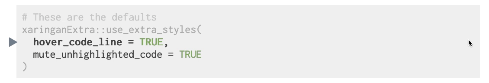

## xaringanExtra

<!-- badges: start -->

<!-- badges: end -->

<!-- Links -->

`xaringanExtra` is a playground of enhancements and extensions for
[xaringan](https://slides.yihuie.name/xaringan) slides.

  - Add an overview of your presentation with [tile view](#tile-view)
  - Make your slides [editable](#editable)
  - Announce slide changes with a [subtle tone](#slide-tone)
  - Animate slide transitions with [animate.css](#animate.css)
  - Add tabbed panels to slides with [panelset](#panelset)
  - Add a logo to all of your slides with [logo](#logo)
  - Use the [Tachyons CSS utility toolkit](#tachyons)
  - Add a live video feed of your [webcam](#webcam)
  - Add one-click code copying with [clipboard](#clipboard)
  - Fit your slides to [fill the browser window](#fit-to-screen)
  - Add [extra CSS styles](#extra-styles)

Each item can be enabled separately, or load everything at once with a
single call.

```` markdown
```{r xaringanExtra, echo=FALSE}
xaringanExtra::use_xaringan_extra(c("tile_view", "animate_css", "tachyons"))
```
````

## Installation

You can install the current version of xaringanExtra from GitHub.

``` r
# install.packages("devtools")
devtools::install_github("gadenbuie/xaringanExtra")
```

## 🗺 Tile View :id=tile-view

<iframe src="./tile-view/index.html" title="Tile View Demo" width=100% height=400px loading=lazy></iframe>
<p align="right"><a href="./tile-view" target="_blank">Tile View Demo<svg version="1.1" xmlns="http://www.w3.org/2000/svg" xmlns:xlink="http://www.w3.org/1999/xlink" x="0px" y="0px" width="12px" height="12px" viewBox="0 0 12 12" style="enable-background:new 0 0 12 12;fill:currentColor;height:1em;width:1em;top:0.18em;position:relative;" xml:space="preserve"><g id="Icons" style="opacity:0.75;"><g id="external"><polygon id="box" style="fill-rule:evenodd;clip-rule:evenodd;" points="2,2 5,2 5,3 3,3 3,9 9,9 9,7 10,7 10,10 2,10   "/><polygon id="arrow_13_" style="fill-rule:evenodd;clip-rule:evenodd;" points="6.211,2 10,2 10,5.789 8.579,4.368 6.447,6.5    5.5,5.553 7.632,3.421   "/></g></g><g id="Guides" style="display:none;"></g></svg></a></p>

Tile view gives you a way to quickly jump between slides. Just press
<kbd>O</kbd> (the letter **O** for **O**verview) at any point in your
slideshow and the tile view appears. Click on a slide to jump to the
slide, or press <kbd>O</kbd> to exit tile view.


To add tile view to your xaringan presentation, add the following code
chunk to your slides’ R Markdown file.

```` markdown
```{r xaringan-tile-view, echo=FALSE}
xaringanExtra::use_tile_view()
```
````

Tile view is heavily inspired by (and is essentially a port to Vanilla
JavaScript of) [a jQuery remarkjs
hook](https://github.com/StephenHesperus/remark-hook/) by the same name
by [Stephen Hesperus](https://github.com/StephenHesperus).

## 📝 Editable :id=editable

<iframe src="./editable/index.html" title="Editable Demo" width=100% height=400px loading=lazy></iframe>
<p align="right"><a href="./editable" target="_blank">Editable Demo<svg version="1.1" xmlns="http://www.w3.org/2000/svg" xmlns:xlink="http://www.w3.org/1999/xlink" x="0px" y="0px" width="12px" height="12px" viewBox="0 0 12 12" style="enable-background:new 0 0 12 12;fill:currentColor;height:1em;width:1em;top:0.18em;position:relative;" xml:space="preserve"><g id="Icons" style="opacity:0.75;"><g id="external"><polygon id="box" style="fill-rule:evenodd;clip-rule:evenodd;" points="2,2 5,2 5,3 3,3 3,9 9,9 9,7 10,7 10,10 2,10   "/><polygon id="arrow_13_" style="fill-rule:evenodd;clip-rule:evenodd;" points="6.211,2 10,2 10,5.789 8.579,4.368 6.447,6.5    5.5,5.553 7.632,3.421   "/></g></g><g id="Guides" style="display:none;"></g></svg></a></p>

Editable gives you a way to write directly inside your slides, updating
your content live. Make any element of your slides editable by using the
`.can-edit[...]` class.


Make your slides editable with the following code chunk.

```` markdown
```{r xaringan-editable, echo=FALSE}
xaringanExtra::use_editable(expires = 1)
```
````

Then, to make a component of your slides editable, use the `.can-edit[]`
class.

``` markdown
## .can-edit[You can edit this slide title]
```

Editable fields that only have the `.can-edit` class are reset whenever
the slides are re-loaded in your browser. If you want to store the
edited values and have them persist across browser sessions, give each
editable field a `.key-<NAME>` class. Be sure to make each key unique
and note that the key name must be a valid CSS class, i.e. it cannot
contain spaces.

``` markdown
## .can-edit.key-firstSlideTitle[Change this title and then reload the page]
```

For more complicated HTML elements, it’s best to make only spans of text
editable, such as

    Hello, .can-edit[world], and welcome to my talk!

or to use placeholder text.

``` markdown
## A few of my favorite things

.can-edit.key-likes[
- thing one
- thing two
]
```

## 🔊 Slide Tone :id=slide-tone

<iframe src="./slide-tone/index.html" title="Slide Tone Demo" width=100% height=400px loading=lazy></iframe>
<p align="right"><a href="./slide-tone" target="_blank">Slide Tone Demo<svg version="1.1" xmlns="http://www.w3.org/2000/svg" xmlns:xlink="http://www.w3.org/1999/xlink" x="0px" y="0px" width="12px" height="12px" viewBox="0 0 12 12" style="enable-background:new 0 0 12 12;fill:currentColor;height:1em;width:1em;top:0.18em;position:relative;" xml:space="preserve"><g id="Icons" style="opacity:0.75;"><g id="external"><polygon id="box" style="fill-rule:evenodd;clip-rule:evenodd;" points="2,2 5,2 5,3 3,3 3,9 9,9 9,7 10,7 10,10 2,10   "/><polygon id="arrow_13_" style="fill-rule:evenodd;clip-rule:evenodd;" points="6.211,2 10,2 10,5.789 8.579,4.368 6.447,6.5    5.5,5.553 7.632,3.421   "/></g></g><g id="Guides" style="display:none;"></g></svg></a></p>

Slide tone plays a subtle sound when you change slides. It was
[requested by a blind R
user](https://github.com/yihui/xaringan/issues/214) and enables users to
hear an auditory signal of their progress through the slides.

The tones increase in pitch for each slide from a low C to a high C
note. The tone pitch stays the same for incremental slides.

Visit the [slide tone demo
slides](https://gadenbuie.github.io/xaringanExtra/slide-tone) to
experience it yourself. Or include slide tone in your next xaringan
presentation by adding the following code chunk to your slides’ R
Markdown.

```` markdown
```{r xaringan-slide-tone, echo=FALSE}
xaringanExtra::use_slide_tone()
```
````

## 📽 Animate.css :id=animate-css

<iframe src="./animate-css/index.html" title="Animate.css Demo" width=100% height=400px loading=lazy></iframe>
<p align="right"><a href="./animate-css" target="_blank">Animate.css Demo<svg version="1.1" xmlns="http://www.w3.org/2000/svg" xmlns:xlink="http://www.w3.org/1999/xlink" x="0px" y="0px" width="12px" height="12px" viewBox="0 0 12 12" style="enable-background:new 0 0 12 12;fill:currentColor;height:1em;width:1em;top:0.18em;position:relative;" xml:space="preserve"><g id="Icons" style="opacity:0.75;"><g id="external"><polygon id="box" style="fill-rule:evenodd;clip-rule:evenodd;" points="2,2 5,2 5,3 3,3 3,9 9,9 9,7 10,7 10,10 2,10   "/><polygon id="arrow_13_" style="fill-rule:evenodd;clip-rule:evenodd;" points="6.211,2 10,2 10,5.789 8.579,4.368 6.447,6.5    5.5,5.553 7.632,3.421   "/></g></g><g id="Guides" style="display:none;"></g></svg></a></p>

[Animate.css](http://daneden.github.io/animate.css) is a popular
collection of CSS animations. It contains

> a bunch of cool, fun, and cross-browser animations for you to use in
> your projects. Great for emphasis, home pages, sliders, and general
> just-add-water-awesomeness.

Use `use_animate_css()` to include the animate.css stylesheets in your
slides. This function automatically modifies the CSS selector that
enables the animation so that only the slides that are visible are
animated. This drastically improves performance on large slide decks
with many animations. For use in other HTML documents, set `xaringan =
FALSE` to load the default `animate.css` file without this performance
tweak.

To use animate.css in your slides, add the following code chunk to your
slides’ R Markdown.

```` markdown
```{r xaringan-animate-css, echo=FALSE}
xaringanExtra::use_animate_css()
```
````

Then add the `animated` class and the [desired animation
class](http://daneden.github.io/animate.css) to the slides you want to
animate. `Out` animations are only applied to slides on exit.

``` markdown
---
class: animated slideInRight fadeOutLeft

## This slide...

- slides in from the right 
- and fades out to the left on exit
```

If you want to use the same slide transitions for all slides, you can
use `use_animate_all()`. This function sets a default in and out
animation for all slides. Animations can be disabled for individual
slides by adding the class `no-animation` to the slide.

```` markdown
```{r xaringan-animate-all, echo=FALSE}
xaringanExtra::use_animate_all("slide_left")
```
````

Note: because `use_animate_all()` only imports the CSS required for the
slide in and slide out animations, you need to also include
`use_animate_css()` (see above) if you want to use other animations from
`animate.css` in your slides.

## 🗂 Panelset :id=panelset

<iframe src="./panelset/index.html" title="Panelset Demo" width=100% height=400px loading=lazy></iframe>
<p align="right"><a href="./panelset" target="_blank">Panelset Demo<svg version="1.1" xmlns="http://www.w3.org/2000/svg" xmlns:xlink="http://www.w3.org/1999/xlink" x="0px" y="0px" width="12px" height="12px" viewBox="0 0 12 12" style="enable-background:new 0 0 12 12;fill:currentColor;height:1em;width:1em;top:0.18em;position:relative;" xml:space="preserve"><g id="Icons" style="opacity:0.75;"><g id="external"><polygon id="box" style="fill-rule:evenodd;clip-rule:evenodd;" points="2,2 5,2 5,3 3,3 3,9 9,9 9,7 10,7 10,10 2,10   "/><polygon id="arrow_13_" style="fill-rule:evenodd;clip-rule:evenodd;" points="6.211,2 10,2 10,5.789 8.579,4.368 6.447,6.5    5.5,5.553 7.632,3.421   "/></g></g><g id="Guides" style="display:none;"></g></svg></a></p>

Panelset adds accessible tabbed panels — just like R Markdown’s
`.tabset` panels — to your xaringan slides. You can activate a panel by
clicking on the tab, or you can use the keyboard. When you reach a slide
with a panelset, the left and right arrows will step through the panels.

To use panelset, add the following chunk to your slides.

```` markdown
```{r xaringan-panelset, echo=FALSE}
xaringanExtra::use_panelset()
```
````


Then, create a `.panelset[...]` that contains `.panels[]`. Each
`.panel[]` should have a `.panel-name[]` and content (everything that
isn’t the panel’s name).

``` markdown
.panel[.panel-name[NAME]
...content...
]
```

Here’s the example used in the demo slides.

```` markdown
.panelset[
.panel[.panel-name[R Code]

```{r panel-chunk, fig.show='hide'}
# ... r code ...
```
]

.panel[.panel-name[Plot]


]
]
````

To customize the appearance of your panels, you can use
`style_panelset()` called directly in an R chunk in your slides.

```` markdown
```{r echo=FALSE}
style_panelset(panel_tab_color_active = "red")
```
````

The panelset uses custom CSS properties to make it easier to change the
styles of the panel tabs. The default values are shown in the CSS code
below. You can copy the whole CSS block to your slides and modify the
values to customize the style to fit your presentation.

```` markdown
```{css echo=FALSE}
.panelset {
  --panel-tab-color: currentColor;
  --panel-tab-color-active: currentColor;
  --panel-tab-color-hover: currentColor;
  --panel-tabs-border-bottom: #ddd;
  --panel-tab-inactive-opacity: 0.5;
  --panel-tab-font-family: Menlo, Consolas, Monaco, Liberation Mono, Lucida Console, monospace;
}
```
````

## 💌 Logo :id=logo

<iframe src="./logo/index.html" title="Logo Demo" width=100% height=400px loading=lazy></iframe>
<p align="right"><a href="./logo" target="_blank">Logo Demo<svg version="1.1" xmlns="http://www.w3.org/2000/svg" xmlns:xlink="http://www.w3.org/1999/xlink" x="0px" y="0px" width="12px" height="12px" viewBox="0 0 12 12" style="enable-background:new 0 0 12 12;fill:currentColor;height:1em;width:1em;top:0.18em;position:relative;" xml:space="preserve"><g id="Icons" style="opacity:0.75;"><g id="external"><polygon id="box" style="fill-rule:evenodd;clip-rule:evenodd;" points="2,2 5,2 5,3 3,3 3,9 9,9 9,7 10,7 10,10 2,10   "/><polygon id="arrow_13_" style="fill-rule:evenodd;clip-rule:evenodd;" points="6.211,2 10,2 10,5.789 8.579,4.368 6.447,6.5    5.5,5.553 7.632,3.421   "/></g></g><g id="Guides" style="display:none;"></g></svg></a></p>

`use_logo()` adds a logo to all of your slides. You can make the logo a
clickable link and choose where on the slide it is placed. You can also
set which types of slides will not get the logo by default.

To add a logo to your xaringan presentation, add the following code
chunk to your slides’ R Markdown file.

```` markdown
```{r xaringan-logo, echo=FALSE}
xaringanExtra::use_logo(
  image_url = "https://raw.githubusercontent.com/rstudio/hex-stickers/master/PNG/xaringan.png"
)
```
````

See the documentation for `?use_logo` for more options regarding sizing
and positioning. You can also make the logo a link using `link_url`.

## 🏗 Tachyons :id=tachyons

<iframe src="./tachyons/index.html" title="Tachyons Demo" width=100% height=400px loading=lazy></iframe>
<p align="right"><a href="./tachyons" target="_blank">Tachyons Demo<svg version="1.1" xmlns="http://www.w3.org/2000/svg" xmlns:xlink="http://www.w3.org/1999/xlink" x="0px" y="0px" width="12px" height="12px" viewBox="0 0 12 12" style="enable-background:new 0 0 12 12;fill:currentColor;height:1em;width:1em;top:0.18em;position:relative;" xml:space="preserve"><g id="Icons" style="opacity:0.75;"><g id="external"><polygon id="box" style="fill-rule:evenodd;clip-rule:evenodd;" points="2,2 5,2 5,3 3,3 3,9 9,9 9,7 10,7 10,10 2,10   "/><polygon id="arrow_13_" style="fill-rule:evenodd;clip-rule:evenodd;" points="6.211,2 10,2 10,5.789 8.579,4.368 6.447,6.5    5.5,5.553 7.632,3.421   "/></g></g><g id="Guides" style="display:none;"></g></svg></a></p>

[Tachyons](http://tachyons.io/) is a collection of CSS utility classes
that works beautifully with
[xaringan](https://slides.yihuie.name/xaringan) presentations and the
[remarkjs](http://remarkjs.com/) class syntax.

To use tachyons in your slides, add the following code chunk to your
slides’ R Markdown.

```` markdown
```{r xaringan-tachyons, echo=FALSE}
xaringanExtra::use_tachyons()
```
````

Tachyons provides small, single-purpose CSS classes that are easily
composed to achieve larger functionality and styles. In the [remarkjs
content classes
syntax](https://github.com/gnab/remark/wiki/Markdown#content-classes),
you can compose classes by chaining them together. For example, the
following markdown produces a box with a washed green background
(`.bg-washed-green`) and a dark green border (`.b--dark-green`) on all
sides (`.ba`) with line width 2 (`.bw2`) and border radius (`.br3`). The
box has a shadow (`.shadow-5`) and medium-large horizontal padding
(`.ph4`) with a large top margin (`.mt5`).

``` markdown
.bg-washed-green.b--dark-green.ba.bw2.br3.shadow-5.ph4.mt5[
The only way to write good code is to write tons of bad code first. 
Feeling shame about bad code stops you from getting to good code

.tr[
— Hadley Wickham
]]
```


Tachyons provides hundreds of CSS classes that are abbreviated and
terse, so it takes some time to learn. In addition to the [tachyons
documentation](http://tachyons.io/), the [Tachyons
Cheatsheet](https://roperzh.github.io/tachyons-cheatsheet/) is an
excellent and easy to use reference.

## 🤳 Webcam :id=webcam

<iframe src="./webcam/index.html" title="Webcam Demo" width=100% height=400px loading=lazy></iframe>
<p align="right"><a href="./webcam" target="_blank">Webcam Demo<svg version="1.1" xmlns="http://www.w3.org/2000/svg" xmlns:xlink="http://www.w3.org/1999/xlink" x="0px" y="0px" width="12px" height="12px" viewBox="0 0 12 12" style="enable-background:new 0 0 12 12;fill:currentColor;height:1em;width:1em;top:0.18em;position:relative;" xml:space="preserve"><g id="Icons" style="opacity:0.75;"><g id="external"><polygon id="box" style="fill-rule:evenodd;clip-rule:evenodd;" points="2,2 5,2 5,3 3,3 3,9 9,9 9,7 10,7 10,10 2,10   "/><polygon id="arrow_13_" style="fill-rule:evenodd;clip-rule:evenodd;" points="6.211,2 10,2 10,5.789 8.579,4.368 6.447,6.5    5.5,5.553 7.632,3.421   "/></g></g><g id="Guides" style="display:none;"></g></svg></a></p>

Add a live video of your webcam into your slides (in your own browser
only). Useful when you are presenting via video conference to include
your video, or when you are recording a class or lecture.

To add **webcam** to your xaringan presentation, add the following code
chunk to your slides’ R Markdown file.

```` markdown
```{r}
xaringanExtra::use_webcam()
```
````

Inside your slides, press **w** to turn the webcam on and off, or press
**Shift** + **W** to move the video to the next corner. You can also
drag and drop the video within the browser window.

The webcam extension is based on the original [webcam
implementation](https://yihui.org/en/2017/12/html5-camera/) by Yihui
Xie, author of [xaringan](https://slides.yihuie.name/xaringan).

## 📋 Clipboard :id=clipboard

<iframe src="./clipboard/index.html" title="Clipboard Demo" width=100% height=400px loading=lazy></iframe>
<p align="right"><a href="./clipboard" target="_blank">Clipboard Demo<svg version="1.1" xmlns="http://www.w3.org/2000/svg" xmlns:xlink="http://www.w3.org/1999/xlink" x="0px" y="0px" width="12px" height="12px" viewBox="0 0 12 12" style="enable-background:new 0 0 12 12;fill:currentColor;height:1em;width:1em;top:0.18em;position:relative;" xml:space="preserve"><g id="Icons" style="opacity:0.75;"><g id="external"><polygon id="box" style="fill-rule:evenodd;clip-rule:evenodd;" points="2,2 5,2 5,3 3,3 3,9 9,9 9,7 10,7 10,10 2,10   "/><polygon id="arrow_13_" style="fill-rule:evenodd;clip-rule:evenodd;" points="6.211,2 10,2 10,5.789 8.579,4.368 6.447,6.5    5.5,5.553 7.632,3.421   "/></g></g><g id="Guides" style="display:none;"></g></svg></a></p>

Add a “Copy Code” button for one-click code chunk copying.

To add **clipboard** to your xaringan presentation or R Markdown
document, add the following code chunk to your slides’ R Markdown file.

```` markdown
```{r xaringanExtra-clipboard, echo=FALSE}
xaringanExtra::use_clipboard()
```
````

You can also customize the text that is shown bby default when hovering
over a code chunk with the `button_text` argument. Use `success_text` to
specify the text shown when the copy action works, or `error_text` for
the text shown when the copy action fails. If the copy action fails, the
text will still be selected, so the user can still manually press
`Ctrl+C` to copy the code chunk.

These options accept raw HTML strings, so you can achieve an icon-only
appearance using FontAwesome icons:

```` markdown
```{r xaringanExtra-clipboard, echo=FALSE}
htmltools::tagList(
  xaringanExtra::use_clipboard(
    button_text = "<i class=\"fa fa-clipboard\"></i>",
    success_text = "<i class=\"fa fa-check\" style=\"color: #90BE6D\"></i>",
    error_text = "<i class=\"fa fa-times-circle\" style=\"color: #F94144\"></i>"
  ),
  rmarkdown::html_dependency_font_awesome()
)
```
````

clipboard works in xaringan slides, R Markdown documents, blogdown
sites, and Shiny apps\!

**Related projects:** For related R packages that provide copy support
via [clipboard.js](https://clipboardjs.com/) see

  - [RLesur/klippy: Copy to Clipboard Buttons for RMarkdown HTML
    Documents](https://github.com/RLesur/klippy)
  - [sbihorel/rclipboard: clipboard.js for R/Shiny
    Applications](https://github.com/sbihorel/rclipboard)

## 📐 Fit to Screen :id=fit-to screen

<iframe src="./fit-screen/index.html" title="Fit to Screen Demo" width=100% height=400px loading=lazy></iframe>
<p align="right"><a href="./fit-screen" target="_blank">Fit to Screen Demo<svg version="1.1" xmlns="http://www.w3.org/2000/svg" xmlns:xlink="http://www.w3.org/1999/xlink" x="0px" y="0px" width="12px" height="12px" viewBox="0 0 12 12" style="enable-background:new 0 0 12 12;fill:currentColor;height:1em;width:1em;top:0.18em;position:relative;" xml:space="preserve"><g id="Icons" style="opacity:0.75;"><g id="external"><polygon id="box" style="fill-rule:evenodd;clip-rule:evenodd;" points="2,2 5,2 5,3 3,3 3,9 9,9 9,7 10,7 10,10 2,10   "/><polygon id="arrow_13_" style="fill-rule:evenodd;clip-rule:evenodd;" points="6.211,2 10,2 10,5.789 8.579,4.368 6.447,6.5    5.5,5.553 7.632,3.421   "/></g></g><g id="Guides" style="display:none;"></g></svg></a></p>

xaringan/remark slides scale at a consistent ratio when the browser
window is resized. In other words, if the slide ratio is `4:3`, then
remark scales the slides and positions them in the browser window so
that they maintain the aspect ratio.

In certain situations, like when showing slides in split screen next to
another window like RStudio, this causes the slides to become rather
small. Alternatively, it’s a great way to be able to adapt your slides
to the aspect ratio of the projector or television screen when you don’t
know the ratio ahead of time.

This extension adds a short cut key — <kbd>Alt</kbd>/<kbd>Option</kbd>+
<kbd>F</kbd> — that fits the slides to the screen and ignores the slide
ratio. (Currently, it only turns on; reload your slides to return to
normal.)


```` markdown
```{r xaringan-fit-screen, echo=FALSE}
xaringanExtra::use_fit_screen()
```
````

## 😎 Extra Styles :id=extra-styles

<iframe src="./extra-styles/index.html" title="Extra Styles Demo" width=100% height=400px loading=lazy></iframe>
<p align="right"><a href="./extra-styles" target="_blank">Extra Styles Demo<svg version="1.1" xmlns="http://www.w3.org/2000/svg" xmlns:xlink="http://www.w3.org/1999/xlink" x="0px" y="0px" width="12px" height="12px" viewBox="0 0 12 12" style="enable-background:new 0 0 12 12;fill:currentColor;height:1em;width:1em;top:0.18em;position:relative;" xml:space="preserve"><g id="Icons" style="opacity:0.75;"><g id="external"><polygon id="box" style="fill-rule:evenodd;clip-rule:evenodd;" points="2,2 5,2 5,3 3,3 3,9 9,9 9,7 10,7 10,10 2,10   "/><polygon id="arrow_13_" style="fill-rule:evenodd;clip-rule:evenodd;" points="6.211,2 10,2 10,5.789 8.579,4.368 6.447,6.5    5.5,5.553 7.632,3.421   "/></g></g><g id="Guides" style="display:none;"></g></svg></a></p>

I’ve collected a few CSS extras that I like to include in my slides,
that I’ve bundled up into the `use_extra_styles()` function.

```` markdown
```{r xaringan-extra-styles}
xaringanExtra::use_extra_styles(
  hover_code_line = TRUE,         #<<
  mute_unhighlighted_code = TRUE  #<<
)
```
````

  - `hover_code_line` adds a little floating triangle next to the
    hovered line in a code chunk

  - `mute_unhighlighted_code` modifies the xaringan/remarkjs line
    highlighting to mute the lines that *aren’t highlighted*.


